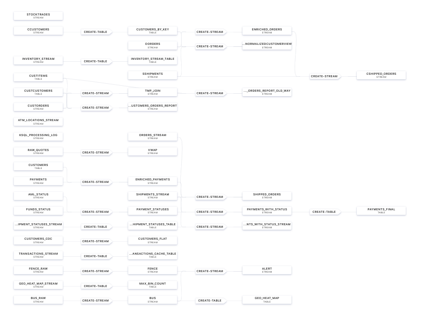

# Confluent Platform 6.1.0 ksqlDB Hands-on Workshop
This github project describes a Hands-on Workshop around Confluent ksqlDB. The structure of the Hands-on is as followed
  * Explaining and Introduce ksqlDB
  * Labs: Get to know the environment
  * Advanced explanation of ksqlDB
  * Advanced ksqlDB Labs to setup real use cases

In general, the hands-on will take 4 hours.

  * Start at 10am: Intro and first labs
  * break at 12am: 1 hour break
  * Continue at 1pm: Additional Labs
  * Finish at 3pm

# Environment for Hands-on Workshop Labs
The Hands-on environment can be deployed in three ways

  1. run Docker-Compose on your own hardware/laptop use docker-locally
  2. create the demo environment in Cloud Provider infrastructure, deploy cloud environment (AWS is prepared here)
  3. Confluent will deploy a cloud infrastructure environment for you, and will send you during the workshop all credentials
  4. Run the workshop in Confluent Cloud, register yourself, start the cluster creation script (coming soon)

# Prerequisites for running environment in Cloud
For an environment in cloud you need to run following components on your machine:

  * Browser with internet access
  * if you want to deploy in our own environment
     * create your own SSH key and deploy in AWS, I use the key name hackathon-temp-key
     * terraform have to be installed
     * Terraform will install everything you need to execute during the workshop on cloud compute instance
  * Having internet access and Ports 8088, 22, 9021 have to be open

# Prerequisites for running environment on own hardware
For an environment on your hardware (Macos):
  * Docker Desktop installed, give Docker 8GB of your RAM
  * curl installed
  * jq installed (or don't use jq)

For Windows Users
  * as well docker Desktop installed
  * Gitbash (Git for windows) installed.
  * don't use jq (do not know if this available on Windows)

In general we will work mostly on the prompt, with ksqlDB cli. But you can also use Confluent Control Center ksqlDB GUI is most cases.

# Hands-on Workshop
Before the workshop you will get informed by Confluent with additional information: Access, Webconference dial-in, etc.

  * Please prepare yourself
     * Please check the documentation and get an rough overview: [ksqldb](https://www.confluent.io/product/ksql/)
     * your hardware should be able to run docker-compose. Docker needs at least 8GB of your RAM
     * or if you are using AWs infrastructure, your hardware should allow ssh access to aws compute.

Note:
We will ask you before the workshop, if you would like to run on your own environment or if you would like to have an environment provisioned by Confluent in the cloud.

# Hands-on Agenda and Labs:
0. We will start first with an environment check:
    * Attendees with an environment provisioned by Confluent should all have an email with credentials etc.
    * Is everything up and running: local, cloud or environment giving by confluent.
    * [Setup the environment](labs/00_Setup-Env.md)
    * We expect a 20 MIN time-slot for this exercise
1. Intro ksqlDB (PPT) - 30 Min
    * RECAP ksqlDB - short presentation by presenter (10 minutes)
    * What is the structure for today? (20 minutes)
2. Labs Financial service - Lab 1 - 4
    * [Payment Status Check](labs/01_usecase_finserv_1.md)
    * [Stock price calculation with User defined functions](labs/02_usecase_finserv_2.md)
    * [Create Stocktrade data](labs/03_usecase_finserv_3.md)
    * [Transaction cache](/labs/04_usecase_finserv_4.md)
3. Labs Retail/Logistics - Lab 5 -7
    * [Real-Time Inventory](labs/05_usecase_realtime_inventory.md)
    * [Track & Trace / Shipments](labs/06_usecase_track-and-trace.md)
    * [Distance calculation](labs/07_usecase_distance.md)
4. Lab Customer Object - Lab 8
    * [De-Normalize a customer object sourced from a simluated DB](labs/08_customer_object.md)
5. Lab Geo Fencing - Lab 9
    * [Doing GEO Fencing with ksqlDB](labs/09_geofencing.md)
6. Labs Operations - Lab 10
    * [Add a ksqlDB App into your environment](labs/09_ksqldb_operations.md)

We will have a LUNCH Break for 60 Minutes (around 12am) and the workshop will finish around 3pm.

If you have implemented all use cases, then your ksqlDB flow will look this this:



# Stop everything
Note: By Confluent provisioned Compute VMs will be destroyed latest at 5pm latest on Workshop day automatically. Outside of cloud compute, please use terraform, to really destroy the environment in the cloud:
```bash
terraform destroy
```
If you inside cloud compute you can stop the environment;
```bash
cd /home/ec2-user/confluent-ksqldb-hands-on-workshop-master/docker/
docker-compose down -v
```
A restart inside the compute:
```bash
docker-compose down -v
docker-compose up -d
```
On your local machine just execute
```bash
cd confluent-ksqldb-hands-on-workshop-master/docker/
docker-compose down -v
```

Thanks a lot for attending
Confluent Team
