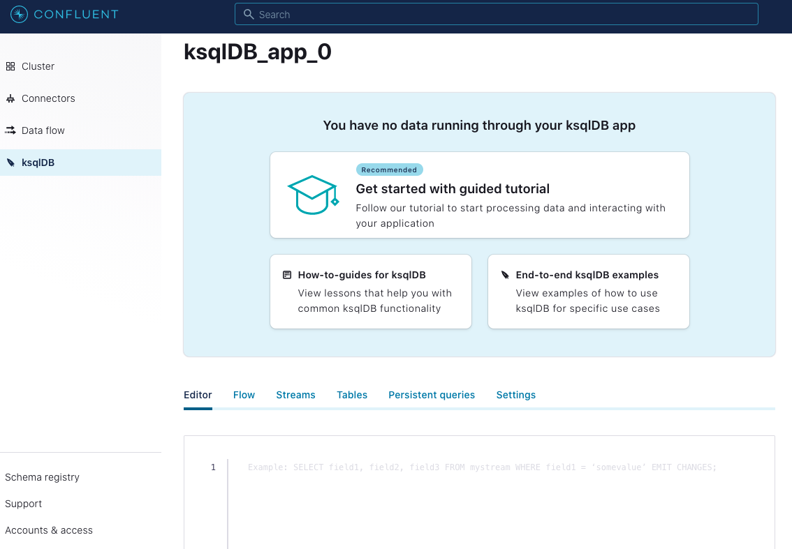
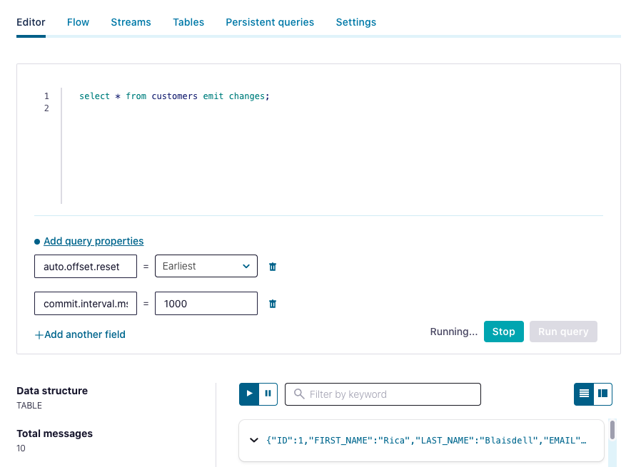
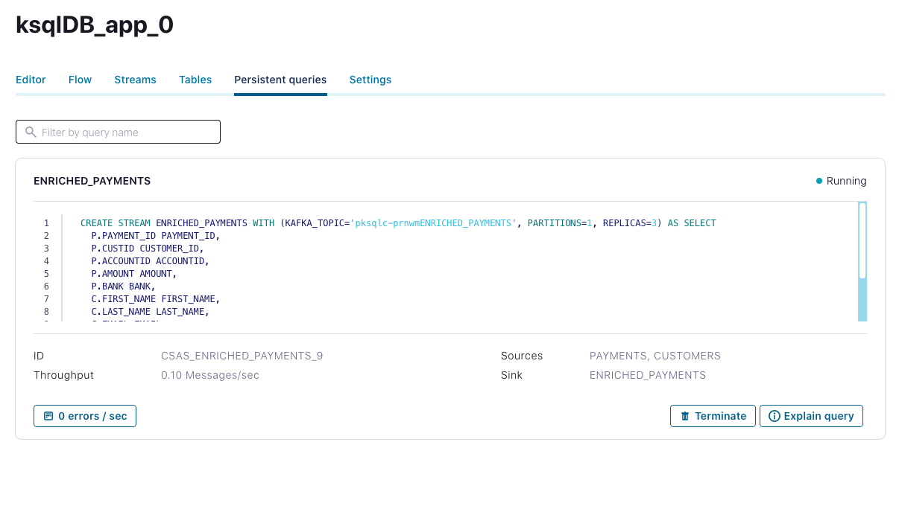
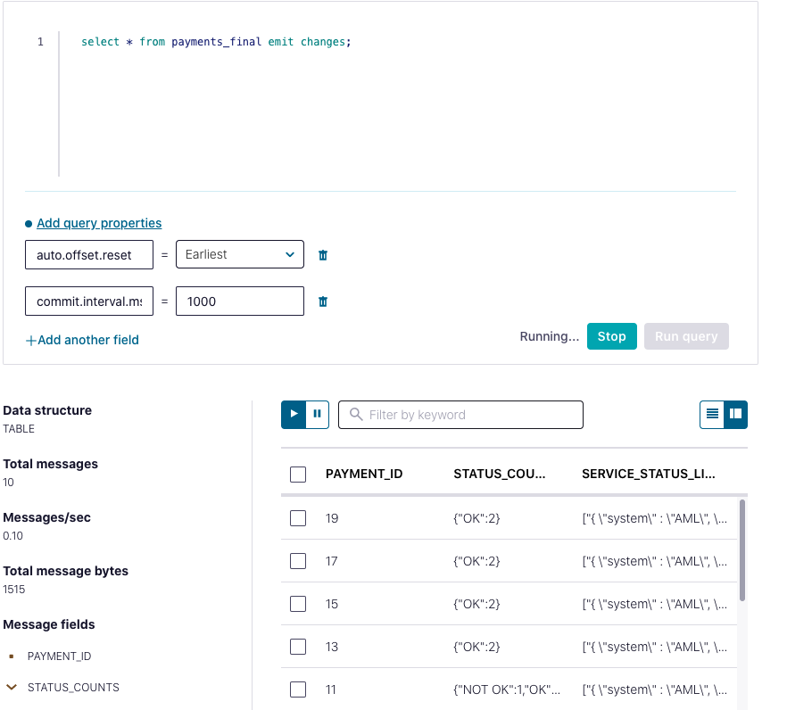
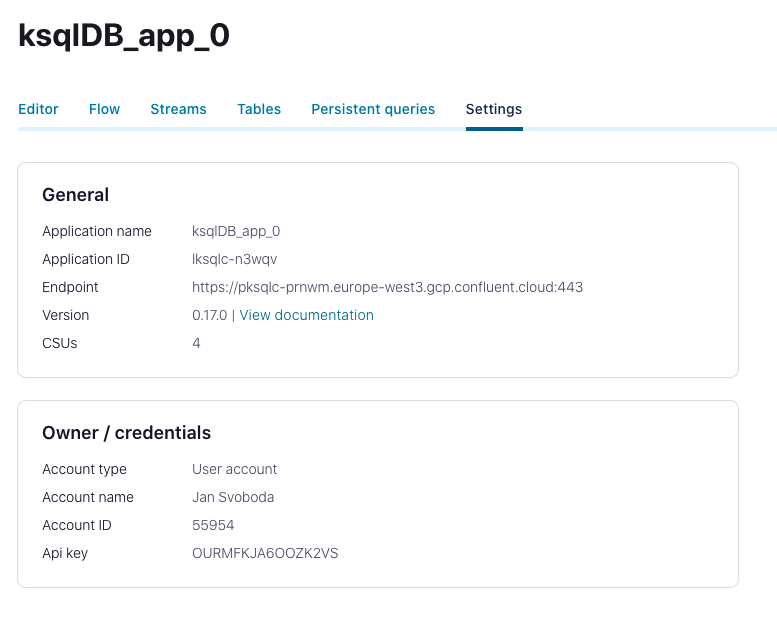

# Finacial services case: Payment Status check (steps for Confluent Cloud)

We are going to build data pipeline which should look like this:


1. Login to Confluent Cloud. Select Org "ksqldb-workshop" and then select your Cluster. From the left panel select "ksqlDB" to display all apps. Select your ksqlDB App to display the ksqlDB Editor. 



Enter following commands (click button "Run query" for each command):
```
show topics;
show streams;
```
Check the properties set for ksqlDB.
```
show properties;
```
2. Create Streams.
```
create stream payments(PAYMENT_ID INTEGER KEY, CUSTID INTEGER, ACCOUNTID INTEGER, AMOUNT INTEGER, BANK VARCHAR) with(kafka_topic='Payment_Instruction', value_format='json');
```
Check your creation with describe and select. You can also use Confluent Control Center for this inspection.
```
describe payments;
```
Create the other streams
```
create stream aml_status(PAYMENT_ID INTEGER, BANK VARCHAR, STATUS VARCHAR) with(kafka_topic='AML_Status', value_format='json');

create stream funds_status (PAYMENT_ID INTEGER, REASON_CODE VARCHAR, STATUS VARCHAR) with(kafka_topic='Funds_Status', value_format='json');

list streams;

create table customers (
          ID INTEGER PRIMARY KEY, 
          FIRST_NAME VARCHAR, 
          LAST_NAME VARCHAR, 
          EMAIL VARCHAR, 
          GENDER VARCHAR, 
          STATUS360 VARCHAR) 
          WITH(kafka_topic='CUSTOMERS_FLAT', value_format='JSON');

list tables;        
```
3. Load Data:
In the ksqlDB Editor add some data to your streams;

3.1 Customer Data:
```
INSERT INTO customers (id, FIRST_NAME, LAST_NAME, EMAIL, GENDER, STATUS360) values (10,'Brena','Tollerton','btollerton9@furl.net','Female','silver');
INSERT INTO customers (id, FIRST_NAME, LAST_NAME, EMAIL, GENDER, STATUS360) values (9,'Even','Tinham','etinham8@facebook.com','Male','silver');
INSERT INTO customers (id, FIRST_NAME, LAST_NAME, EMAIL, GENDER, STATUS360) values (8,'Patti','Rosten','prosten7@ihg.com','Female','silver');
INSERT INTO customers (id, FIRST_NAME, LAST_NAME, EMAIL, GENDER, STATUS360) values (7,'Fay','Huc','fhuc6@quantcast.com','Female','bronze');
INSERT INTO customers (id, FIRST_NAME, LAST_NAME, EMAIL, GENDER, STATUS360) values (6,'Robinet','Leheude','rleheude5@reddit.com','Female','platinum');
INSERT INTO customers (id, FIRST_NAME, LAST_NAME, EMAIL, GENDER, STATUS360) values (5,'Hansiain','Coda','hcoda4@senate.gov','Male','platinum');
INSERT INTO customers (id, FIRST_NAME, LAST_NAME, EMAIL, GENDER, STATUS360) values (4,'Hashim','Rumke','hrumke3@sohu.com','Male','platinum');
INSERT INTO customers (id, FIRST_NAME, LAST_NAME, EMAIL, GENDER, STATUS360) values (3,'Mariejeanne','Cocci','mcocci2@techcrunch.com','Female','bronze');
INSERT INTO customers (id, FIRST_NAME, LAST_NAME, EMAIL, GENDER, STATUS360) values (2,'Ruthie','Brockherst','rbrockherst1@ow.ly','Female','platinum');
INSERT INTO customers (id, FIRST_NAME, LAST_NAME, EMAIL, GENDER, STATUS360) values (1,'Rica','Blaisdell','rblaisdell0@rambler.ru','Female','bronze');
```
3.2 Payment Instruction Data
```
insert into payments (PAYMENT_ID, CUSTID, ACCOUNTID, AMOUNT, BANK) values (1,1,1234000,100,'DBS');
insert into payments (PAYMENT_ID, CUSTID, ACCOUNTID, AMOUNT, BANK) values (3,2,1234100,200,'Barclays Bank');
insert into payments (PAYMENT_ID, CUSTID, ACCOUNTID, AMOUNT, BANK) values (5,3,1234200,300,'BNP Paribas');
insert into payments (PAYMENT_ID, CUSTID, ACCOUNTID, AMOUNT, BANK) values (7,4,1234300,400,'Wells Fargo');
insert into payments (PAYMENT_ID, CUSTID, ACCOUNTID, AMOUNT, BANK) values (9,5,1234400,500,'DBS');
insert into payments (PAYMENT_ID, CUSTID, ACCOUNTID, AMOUNT, BANK) values (11,6,1234500,600,'Royal Bank of Canada');
insert into payments (PAYMENT_ID, CUSTID, ACCOUNTID, AMOUNT, BANK) values (13,7,1234600,700,'DBS');
insert into payments (PAYMENT_ID, CUSTID, ACCOUNTID, AMOUNT, BANK) values (15,8,1234700,800,'DBS');
insert into payments (PAYMENT_ID, CUSTID, ACCOUNTID, AMOUNT, BANK) values (17,9,1234800,900,'DBS');
insert into payments (PAYMENT_ID, CUSTID, ACCOUNTID, AMOUNT, BANK) values (19,10,1234900,1000,'United Overseas Bank');
```
3.2 ALM Status Data
```
insert into aml_status(PAYMENT_ID,BANK,STATUS) values (1,'Wells Fargo','OK');
insert into aml_status(PAYMENT_ID,BANK,STATUS) values (3,'Commonwealth Bank of Australia','OK');
insert into aml_status(PAYMENT_ID,BANK,STATUS) values (5,'Deutsche Bank','OK');
insert into aml_status(PAYMENT_ID,BANK,STATUS) values (7,'DBS','OK');
insert into aml_status(PAYMENT_ID,BANK,STATUS) values (9,'United Overseas Bank','OK');
insert into aml_status(PAYMENT_ID,BANK,STATUS) values (11,'Citi','OK');
insert into aml_status(PAYMENT_ID,BANK,STATUS) values (13,'Commonwealth Bank of Australia','OK');
insert into aml_status(PAYMENT_ID,BANK,STATUS) values (15,'Barclays Bank','OK');
insert into aml_status(PAYMENT_ID,BANK,STATUS) values (17,'United Overseas Bank','OK');
insert into aml_status(PAYMENT_ID,BANK,STATUS) values (19,'Royal Bank of Canada','OK');
```
3.2 Funds Status Data
```
insert into funds_status(PAYMENT_ID,REASON_CODE,STATUS) values (1,'00','OK');
insert into funds_status(PAYMENT_ID,REASON_CODE,STATUS) values (3,'99','OK');
insert into funds_status(PAYMENT_ID,REASON_CODE,STATUS) values (5,'30','OK');
insert into funds_status(PAYMENT_ID,REASON_CODE,STATUS) values (7,'00','OK');
insert into funds_status(PAYMENT_ID,REASON_CODE,STATUS) values (9,'00','OK');
insert into funds_status(PAYMENT_ID,REASON_CODE,STATUS) values (11,'00','NOT OK');
insert into funds_status(PAYMENT_ID,REASON_CODE,STATUS) values (13,'30','OK');
insert into funds_status(PAYMENT_ID,REASON_CODE,STATUS) values (15,'00','OK');
insert into funds_status(PAYMENT_ID,REASON_CODE,STATUS) values (17,'10','OK');
insert into funds_status(PAYMENT_ID,REASON_CODE,STATUS) values (19,'10','OK');
```
4. Play with data

Please set the following query properties 
* 'auto.offset.reset' to 'earliest'
* 'commit.interval.ms' to '1000'
to query your streams and table



```
select * from customers emit changes;

select * from customers where id=1 emit changes;

select * from payments emit changes;

select * from aml_status emit changes;

select * from funds_status emit changes;

```
5. Enriching Payments with Customer details
```
create stream enriched_payments as select
p.payment_id as payment_id,
p.custid as customer_id,
p.accountid,
p.amount,
p.bank,
c.first_name,
c.last_name,
c.email,
c.status360
from payments p left join customers c on p.custid = c.id;

describe ENRICHED_PAYMENTS;

select * from enriched_payments emit changes;
```
Now check in Confluent Cloud UI:
* check in ksqlDB App - the persistent queries. Take a look in the details (SINK: and SOURCE:) of the running queries.
* check in ksqlDB App the flow to follow the expansion easier. If it is not visible refresh the webpage in browser.



6. Combining the status streams
```
CREATE STREAM payment_statuses AS SELECT payment_id, status, 'AML' as source_system FROM aml_status;

INSERT INTO payment_statuses SELECT payment_id, status, 'FUNDS' as source_system FROM funds_status;

describe payment_statuses;

select * from payment_statuses emit changes;
```
Combine payment and status events in 1 hour window. Why we need a timing window for stream-stream join?
```
CREATE STREAM payments_with_status AS SELECT
  ep.payment_id as payment_id,
  ep.accountid,
  ep.amount,
  ep.bank,
  ep.first_name,
  ep.last_name,
  ep.email,
  ep.status360,
  ps.status,
  ps.source_system
  FROM enriched_payments ep LEFT JOIN payment_statuses ps WITHIN 1 HOUR ON ep.payment_id = ps.payment_id ;

describe payments_with_status;

select * from payments_with_status emit changes;

select * from payments_with_status emit changes limit 10;
```
7. Check in the ksqldb area the ksqldb flow to follow the expansion easier

Aggregate into consolidated records
```
CREATE TABLE payments_final AS SELECT
  payment_id,
  histogram(status) as status_counts,
  collect_list('{ "system" : "' + source_system + '", "status" : "' + STATUS + '"}') as service_status_list
  from payments_with_status
  where status is not null
  group by payment_id;

describe PAYMENTS_FINAL ;

select * from payments_final emit changes limit 1;
```



Pull queries, check value for a specific payment (snapshot lookup). Pull Query is a Preview feature.
```
select * from payments_final where payment_id=1;
```

8. Query by REST Call
Get the REST Endpoint from the Settings menu and execute query with your credentials copies from properties File



```
curl -X "POST" "https://yourserver.europe-west1.gcp.confluent.cloud:443/query" \
     -u KEY:SECRET \
     -H "Content-Type: application/vnd.ksql.v1+json; charset=utf-8" \
     -d $'{"ksql": "select * from payments_final where payment_id=1;","streamsProperties": {}}' | jq
```
list streams via curl
```
curl -X "POST" "https://yourserver.europe-west1.gcp.confluent.cloud:443/ksql" \
     -u KEY:SECRET \
     -H "Content-Type: application/vnd.ksql.v1+json; charset=utf-8" \
     -d $'{"ksql": "LIST STREAMS;","streamsProperties": {}}' | jq        
```

END Lab 1 

Final table with payment statuses


[go back to Agenda](https://github.com/ora0600/confluent-ksqldb-hands-on-workshop/blob/master/README.md#hands-on-agenda-and-labs)
