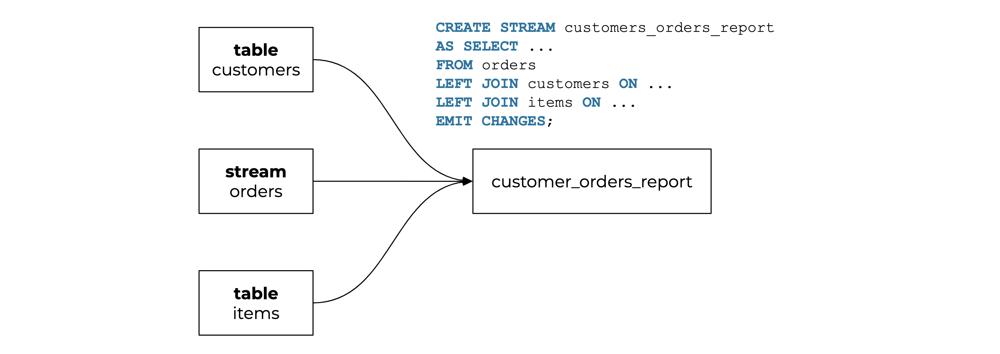

# De-normalize a customer object with ksqlDB (ready for Confluent Cloud)
We prepared two demos where we de-normalized so to say database tables into Confluent Platform kafka. The use case behind this is to do preprocessing events directly in the Kafka cluster and not in the target system. Jay kreps named this architecture pattern Kappa-Architecture.

## Demo 1: de-normalize customer tables in Confluent Kafka cluster
This sample is not prepared for Confluent Cloud. Please use docker-compose instead. There Connectors are ready and prepared

## Demo 2: de-normalize customer data of orders in Apache Kafka and create a complete Customer Order Report

Another sample should make it more viewable how easy it is to de-normalize a customer object. We would like to create a customer order report.

For the Confluent Cloud environment topics are already created. Please in yxour Confluent Cloud topic viewer.
We will execute all commands in Confluent Cloud ksqlDB Editor. 

```bash
ksql> SET 'auto.offset.reset' = 'earliest';
ksql> CREATE TABLE custcustomers (customerid STRING PRIMARY KEY, customername STRING) WITH (KAFKA_TOPIC='custcustomers', VALUE_FORMAT='json'); 
ksql> describe custcustomers;
ksql> CREATE STREAM custorders (orderid STRING KEY, customerid STRING, itemid STRING, purchasedate STRING) WITH (KAFKA_TOPIC='custorders', VALUE_FORMAT='json');
ksql> describe custorders;
ksql> CREATE TABLE custitems (itemid STRING PRIMARY KEY, itemname STRING) WITH (KAFKA_TOPIC='custitems', VALUE_FORMAT='json');
ksql> describe custitems;
# you can copy and paste all insert statements into C3 ksqlDB Editor
ksql> INSERT INTO custcustomers (customerid , customername) VALUES ('1','Carsten Muetzlitz');
 INSERT INTO custcustomers (customerid , customername) VALUES ('2','Jan Svoboda');
 INSERT INTO custcustomers (customerid , customername) VALUES ('3','Suvad Sahovic');
ksql> select * from custcustomers emit changes limit 3;
# you can copy and paste all insert statements into C3 ksqlDB Editor
ksql> INSERT INTO custitems (itemid , itemname ) VALUES ('1','MacBook Air');
INSERT INTO custitems (itemid , itemname ) VALUES ('2','Apple Pencil');
INSERT INTO custitems (itemid , itemname ) VALUES ('3','iPad Pro');
INSERT INTO custitems (itemid , itemname ) VALUES ('4','Apple Watch');
INSERT INTO custitems (itemid , itemname ) VALUES ('5','iPhone 12');
INSERT INTO custitems (itemid , itemname ) VALUES ('6','Apple TV');
ksql> select * from custitems emit changes limit 6;
# you can copy and paste all insert statements into C3 ksqlDB Editor
ksql> INSERT INTO custorders (orderid, customerid , itemid , purchasedate ) VALUES ('1','1','1','2021-03-23');
INSERT INTO custorders (orderid, customerid , itemid , purchasedate ) VALUES ('2','1','2','2021-03-23');
INSERT INTO custorders (orderid, customerid , itemid , purchasedate ) VALUES ('3','3','3','2021-03-23');
INSERT INTO custorders (orderid, customerid , itemid , purchasedate ) VALUES ('4','3','4','2021-03-23');
INSERT INTO custorders (orderid, customerid , itemid , purchasedate ) VALUES ('5','2','5','2021-03-23');
INSERT INTO custorders (orderid, customerid , itemid , purchasedate ) VALUES ('6','2','6','2021-03-23');
KSQL> select * from custorders emit changes limit 6;
```
Let's join everything together. With ksqlDB lower 0.9 you need to go the old way.
```bash
ksql> CREATE STREAM tmp_join AS
SELECT c.customerid AS customerid, c.customername, o.orderid, o.itemid, o.purchasedate
FROM custorders as o
INNER JOIN custcustomers as c ON o.customerid = c.customerid
EMIT CHANGES;
ksql> CREATE STREAM customers_orders_report_old_way AS
SELECT t.customerid, t.customername, t.orderid, t.itemid, i.itemname, t.purchasedate
FROM tmp_join as t
LEFT JOIN custitems as i ON t.itemid = i.itemid
EMIT CHANGES;
ksql> select * from customers_orders_report_old_way emit changes;
```
I would say the old way is more complex and cost more resources. With ksqlDB >= 0.9 you can do multi-join. This is much more easier and generate less costs in terms of resource usage.
```bash
ksql> CREATE STREAM customers_orders_report AS
SELECT c.customerid AS customerid, c.customername, o.orderid, i.itemid, i.itemname, o.purchasedate
FROM custorders as o
LEFT JOIN custcustomers as c ON o.customerid = c.customerid
LEFT JOIN custitems as i ON o.itemid = i.itemid
EMIT CHANGES;
ksql> select * from customers_orders_report emit changes;
```
You can compare both ways. 
ATTENTION: Modify the sequence number below "_53", "_55", "_57" with your own sequence number.  
You will get the correct query-id from `describe extended <stream>;`or via persistent Query Tab in ksqlDB Editor.

```bash
ksql> explain CSAS_CUSTOMERS_ORDERS_REPORT_11;
# compare it with:
ksql> explain CSAS_CUSTOMERS_ORDERS_REPORT_OLD_WAY_9;
ksql> explain CSAS_TMP_JOIN_7;
ksql> exit;
```
and you will see the old way has 3 topics in total and multi-join 5 topics.

This Lab will show that is does make much sense for specific cases to do the pre-processing in an ETL pipeline direcly in Apache Kafka. Why loading more data into sink (e.g. a DWH like big query)? You can prepare what ever you need directly in Kafka.

But please be aware that for running ksqlDB clusters it make sense to [plan the capacity](https://docs.ksqldb.io/en/latest/operate-and-deploy/capacity-planning/).

End lab8

[go back to Agenda](https://github.com/ora0600/confluent-ksqldb-hands-on-workshop/blob/master/README.md#hands-on-agenda-and-labs)
